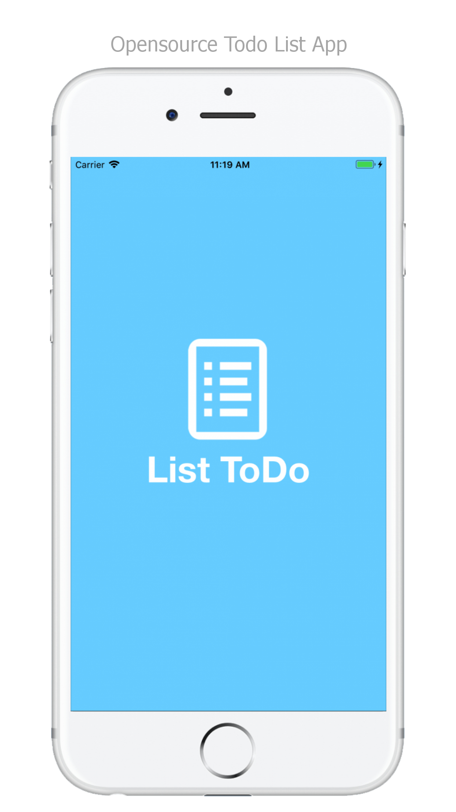
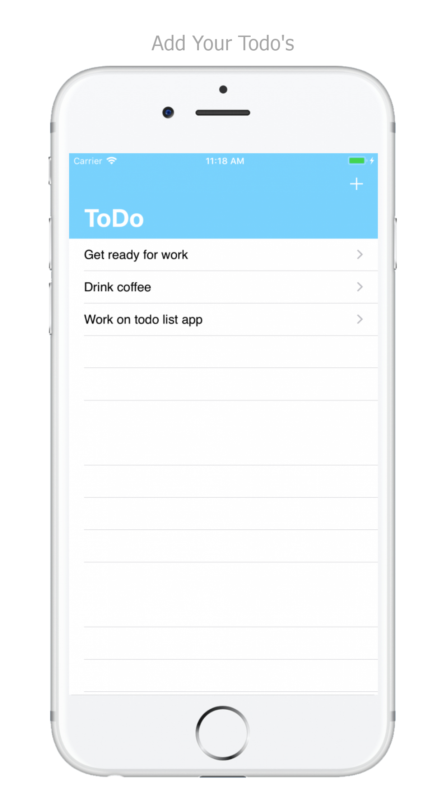

# ListTodo
> An opensource todo list app.

[![4.1][swift-image]][swift-url]
[![Build Status][travis-image]][travis-url]
[![License][license-image]][license-url]

ListTodo is a simple app made for making todo list. From the top right plus icon the user can add a todo and description. The app uses core data and is best for learning purposes. The app follow MVC architecture, which is organized in an elegant way.

 

## Features

- [x] Add Notes
- [x] View Notes

## Requirements

- iOS 11.0+
- Xcode 9.2

## Installation

#### Manually
1. Download and open the project file.  
2. Congratulations!  

## Contribute

We would love you for the contribution to **ListTodo**, check the ``LICENSE`` file for more info.

## Meta

Moaz Khan – moazkh60@gmail.com

Distributed under the Opensource license. See ``LICENSE`` for more information.

[https://github.com/moazkh60](https://github.com/moazkh60)

[swift-image]:https://img.shields.io/badge/swift-4.1-orange.svg
[swift-url]: https://swift.org/
[license-image]: https://img.shields.io/badge/License-GPL%20v3-blue.svg
[license-url]: LICENSE
[travis-image]: https://img.shields.io/travis/dbader/node-datadog-metrics/master.svg?style=flat-square
[travis-url]: https://travis-ci.org/dbader/node-datadog-metrics
[codebeat-image]: https://codebeat.co/badges/c19b47ea-2f9d-45df-8458-b2d952fe9dad
[codebeat-url]: https://codebeat.co/projects/github-com-vsouza-awesomeios-com
